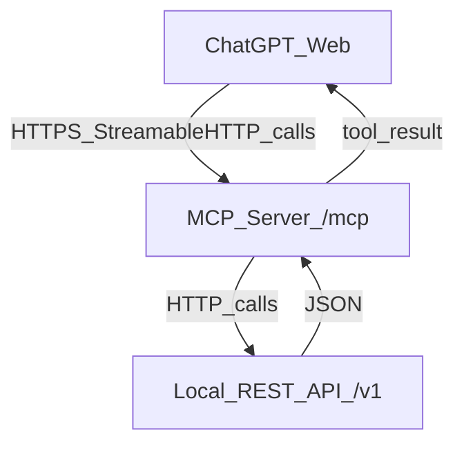

# Live local demo: REST API → tool → MCP server → ChatGPT

## Goal

Build a **real, working local demo** where:

- A local **Demo Commerce REST API** serves `/v1/products` and `/v1/products/search`.
- Your existing generator (`poc_generate.py`) produces a **working `search_products` tool** from OpenAPI.
- That tool is wrapped into a **real MCP server** using **Python** and **Streamable HTTP** at **`/mcp`**.
- The MCP server is exposed via **HTTPS** (e.g., `ngrok`) and connected in **ChatGPT → Connector URL**.

## Why this architecture (fits ChatGPT web)

- ChatGPT web connectors require **HTTPS** and typically connect to an MCP endpoint like `https://<public-host>/mcp`.
- MCP spec recommends **Streamable HTTP** transport (HTTP POST/GET, optional SSE). Your MCP server will expose this at `/mcp`.

## Step-by-step plan

### 1) Implement the local demo REST API (authoritative backend)

- Create a small FastAPI service (new folder, e.g. `demo_api/`) that implements:
- `GET /v1/products?category=&limit=`
- `GET /v1/products/search?q=&limit=`
- Use an in-memory dataset (JSON file checked into repo) so the demo is deterministic.
- Ensure it serves correct **OpenAPI** automatically at `/openapi.json` (FastAPI default), so we can generate tools from the *real* spec later.

**Acceptance check**

- Hitting `/v1/products/search?q=widget` returns an array of products matching `POC/sample_openapi.json`’s `Product` schema.

### 2) Align the OpenAPI spec used by the generator

You have two options; pick one and stick to it:

- **Option A (recommended)**: Use the FastAPI-generated `openapi.json` as the source of truth.
- **Option B**: Keep using [`POC/sample_openapi.json`](c:/Users/nadav/Documents/GitHub/Base55/POC/sample_openapi.json) but change its `servers[0].url `to `http://127.0.0.1:<api_port>/v1` for the demo.

### 3) Generate the tool code from OpenAPI (POC pipeline)

- Run [`POC/poc_generate.py`](c:/Users/nadav/Documents/GitHub/Base55/POC/poc_generate.py) with [`POC/template_products.json`](c:/Users/nadav/Documents/GitHub/Base55/POC/template_products.json) and your chosen OpenAPI JSON.
- Ensure the generated output respects the template’s “POC mode” constraints:
- **No** `@mcp.tool()` decorator
- **No** `mcp = ...` server wiring
- `async def search_products(query: str) -> dict:`

**Note**: The current [`generated/search_products.py`](c:/Users/nadav/Documents/GitHub/Base55/generated/search_products.py) includes `@mcp.tool()` and a fake base URL; we’ll regenerate or adjust the prompt so the output is function-only and uses a configurable base URL.

### 4) Create the real MCP server (Python, Streamable HTTP)

- Add a new folder (e.g. `mcp_server/`) that:
- Imports the generated `search_products` function.
- Instantiates `FastMCP(..., stateless_http=True, json_response=True)`.
- Registers the tool via `@mcp.tool()` **in the server layer** (not in the generated file), calling into the generated function.
- Runs the server with `transport="streamable-http"`, exposing the MCP endpoint at **`http://127.0.0.1:<mcp_port>/mcp`**.
- Make the REST API base URL configurable (env var like `DEMO_API_BASE_URL=http://127.0.0.1:<api_port>/v1`).

**Acceptance check**

- From a local client (or MCP Inspector), `tools/list` shows `search_products`.
- `tools/call` for `search_products` returns `{"products": [...]}`.

### 5) Validate locally with MCP Inspector (before ChatGPT)

- Use the MCP Inspector to:
- Connect to `http://127.0.0.1:<mcp_port>/mcp`
- List tools
- Call `search_products` with a few queries

This isolates issues (schemas, transport, HTTP failures) before involving ChatGPT.

### 6) Expose the MCP server over HTTPS (required for ChatGPT web)

- Tunnel the MCP server port using `ngrok` (or `cloudflared`):
- `ngrok http <mcp_port>`
- Confirm the public URL works:
- `https://<subdomain>.ngrok.app/mcp`

### 7) Connect in ChatGPT (Connector URL)

- In ChatGPT: enable developer mode (if needed), create a connector.
- Set **Connector URL** to the tunneled MCP endpoint:
- `https://<subdomain>.ngrok.app/mcp`
- Start a chat and prompt for something that should invoke the tool, e.g. “Search products for ‘widget’ and show the top 5.”

### 8) Demo script + “it really works” proof

- Keep logs visible for both services:
- REST API logs show `/v1/products/search` requests.
- MCP server logs show `tools/call` and tool execution.
- Run 3 scripted prompts:
- Basic: “Search products for ‘widget’.”
- Edge: “Search products for an empty string.”
- Robustness: “Search products for ‘nonexistent’ and explain the result.”

## Deliverables added to this repo

- `demo_api/` (local REST API + sample data)
- `mcp_server/` (FastMCP server exposing `/mcp` via streamable-http)
- Updated `generated/search_products.py` (function-only output) or regeneration instructions
- A short runbook in [`README.md`](c:/Users/nadav/Documents/GitHub/Base55/README.md) or a new `DEMO.md`

## Common pitfalls (we’ll avoid)

- **Wrong transport**: ChatGPT web needs HTTPS; we’ll use Streamable HTTP at `/mcp` + ngrok.
- **Hardcoded base URL**: use env var for REST API base URL.