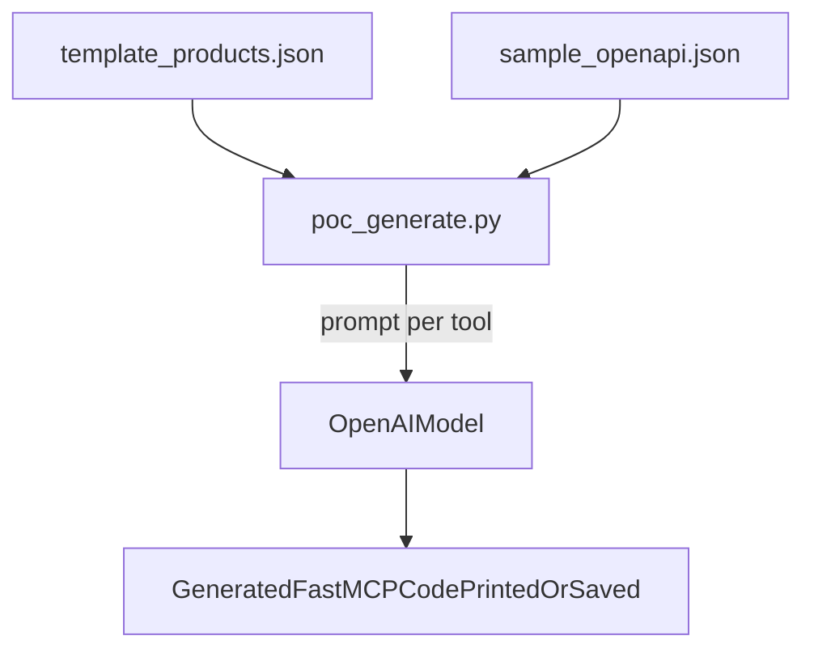

# Build the POC template example in `POC/` (with dummy endpoints)

## Goal

Create a self-contained POC under `POC/` that matches `POC/poc_mcp_generator_plan.md`: a `Products` template JSON + a sample OpenAPI spec + a Python script that prompts GPT to generate FastMCP-compatible tool code.Unlike a “clean” spec, the bundled OpenAPI will include **wrong-domain dummy endpoints** so we can test whether the model correctly selects the relevant product endpoint(s).

## Files to add (all under `POC/`)

- [`POC/template_products.json`](POC/template_products.json): the template from the plan (tool name `search_products`, with input/output JSON schemas and a base generation prompt).
- [`POC/sample_openapi.json`](POC/sample_openapi.json): a **fully custom OpenAPI JSON** with:
- **Real-ish product endpoints** the model should use for `search_products` (e.g., `GET /products` and/or `GET /products/search?q=...`).
- **Wrong-domain dummy endpoints** intended to distract (e.g., `/orders/*`, `/users/*`, `/auth/*`), with plausible-looking request/response schemas.
- [`POC/poc_generate.py`](POC/poc_generate.py): runnable script that loads the template + OpenAPI spec, builds a prompt per tool, calls OpenAI (SDK v1, using `OPENAI_API_KEY` from env), and prints the generated Python tool code.
- [`POC/requirements.txt`](POC/requirements.txt): minimal dependencies (OpenAI SDK).
- [`POC/README.md`](POC/README.md): exact run instructions.

## What the custom OpenAPI spec will look like

- **Correct domain**:
- `GET /products`: return list of products.
- `GET /products/search`: accepts `q` query param; returns filtered products.
- Product schema includes `id`, `title`, `price`, `image_url` (to align with the template output).
- **Wrong-domain dummy endpoints** (examples):
- `GET /orders/search?query=` returning `Order` objects.
- `GET /users/search?query=` returning `User` objects.
- `POST /auth/token` returning tokens.

These dummy endpoints are intentionally “tempting” (they include `search` + `query`) but have mismatched schemas so a good mapping should avoid them.

## Implementation details

- **OpenAI client**: OpenAI Python SDK v1 style.
- Read key from environment: `OPENAI_API_KEY`.
- Default model: `gpt-4o-mini` (override via env or CLI).
- **Prompt construction**:
- Lead with `template["generation_prompt"]`.
- Include a truncated OpenAPI JSON dump.
- Include tool name/description + input/output schema.
- Instruct model to:
    - Identify the best matching endpoint(s) from the spec.
    - Ignore unrelated endpoints.
    - Return only valid Python code.

## Run instructions (what `POC/README.md` will contain)

- Create venv, install requirements.
- Set `OPENAI_API_KEY`.
- Run:
- `python POC/poc_generate.py --template POC/template_products.json --openapi POC/sample_openapi.json`

## Mermaid (high-level flow)

## Implementation todos