# Base55

> Generate ready-to-deploy **MCP servers** with a visual product carousel/grid — from an OpenAPI spec or a Shopify store.

```text
┌──────────────┐     ┌──────────────┐     ┌──────────────┐     ┌──────────────┐
│   Wizard UI  │────►│   Backend    │────►│  server.zip  │────►│  MCP Host    │
│  (browser)   │     │  :3001       │     │  FastMCP     │     │ Claude/Goose │
└──────────────┘     └──────────────┘     └──────────────┘     └──────────────┘
```

Base55 is a web-based wizard that builds a downloadable Python FastMCP package: tools that fetch products + an HTML carousel/grid UI you can run inside Claude Desktop, Goose, MCP Inspector, or any MCP host.

---

## At a glance

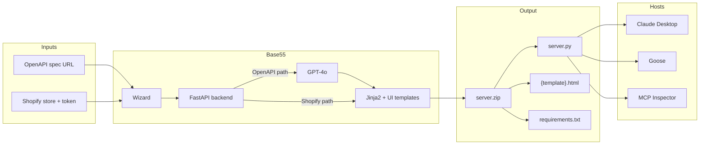

| Generated file | Role |
|----------------|------|
| `server.py` | FastMCP MCP server (stdio) + product tools + UI resource |
| `requirements.txt` | `fastmcp==3.2.4`, `httpx` |
| `{template}.html` | Color-customized carousel or grid |

---

## Table of contents

1. [System map](#system-map)
2. [What you get](#what-you-get)
3. [Prerequisites](#prerequisites)
4. [Environment setup](#environment-setup)
5. [Quick start](#quick-start)
6. [Wizard walkthrough](#wizard-walkthrough)
7. [OpenAPI path](#openapi-path)
8. [Shopify path](#shopify-path)
9. [Demo commerce API](#demo-commerce-api)
10. [Generated server output](#generated-server-output)
11. [Connecting MCP hosts](#connecting-mcp-hosts)
12. [Architecture deep dive](#architecture-deep-dive)
13. [Backend API reference](#backend-api-reference)
14. [UI templates and theming](#ui-templates-and-theming)
15. [Repository layout](#repository-layout)
16. [Development and tests](#development-and-tests)
17. [Troubleshooting](#troubleshooting)
18. [Security notes](#security-notes)
19. [Legacy code](#legacy-code)

---

## System map

How the pieces talk to each other while you generate, then while you run:

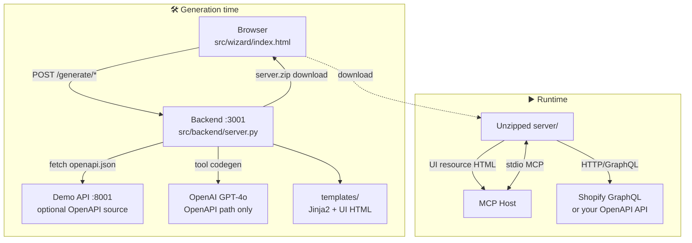

**Ports cheat-sheet**

```text
  :3001  ──  Base55 generator backend
  :8001  ──  Demo commerce API (OpenAPI testing)
  stdio  ──  Generated MCP server (no HTTP port)
```

---

## What you get

### Two generation paths

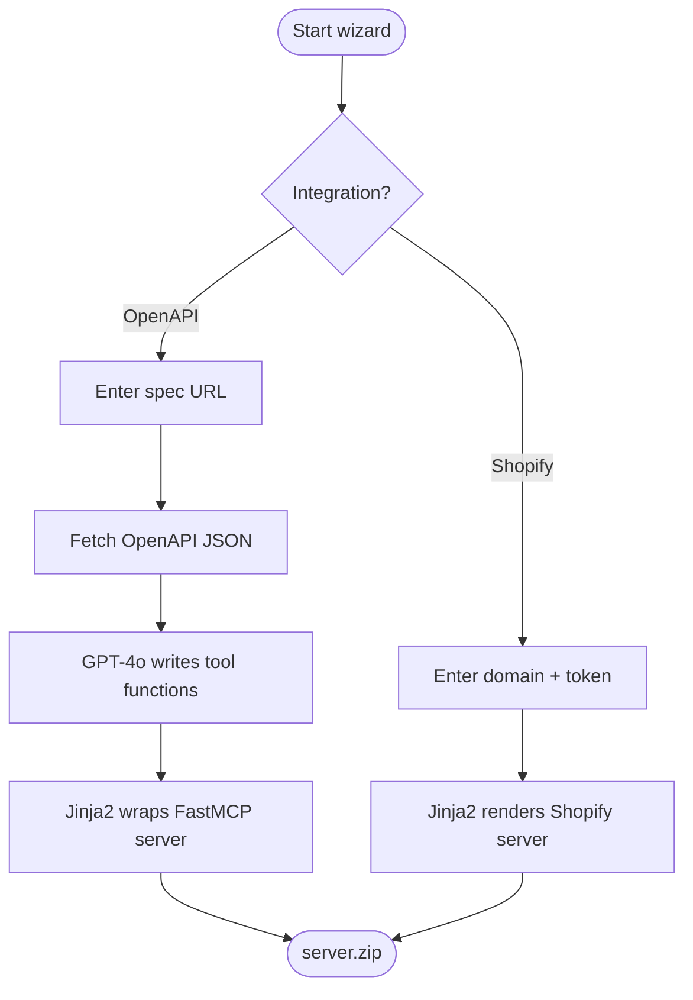

| Path | Needs OpenAI? | What happens |
|------|---------------|--------------|
| **OpenAPI** | Yes (`OPENAI_API_KEY`) | Fetch spec → GPT writes product tool functions → Jinja2 + UI zip |
| **Shopify** | No | Instant Jinja2 render with hardcoded Storefront credentials |

### Three UI templates

```text
  ┌──────────────── carousel ────────────────┐
  │  ◄  [card] [card] [card] [card]  ►       │  dark horizontal scroll
  └──────────────────────────────────────────┘

  ┌──────────── carousel-light ──────────────┐
  │  ◄  [card] [card] [card] [card]  ►       │  light horizontal scroll
  └──────────────────────────────────────────┘

  ┌────────────── grid-dark ─────────────────┐
  │  [card] [card] [card]                    │  compact 2–3 columns
  │  [card] [card] [card]                    │
  └──────────────────────────────────────────┘
```

| Wizard name | Template id | Description |
|-------------|-------------|-------------|
| Dark Carousel | `carousel` | Dark horizontal product scroll |
| Light Carousel | `carousel-light` | Light horizontal product scroll |
| Dark Grid | `grid-dark` | Dark compact 2–3 column grid |

Theme knobs (CSS variables): `--primary-color` · `--accent-color` · `--bg-color`

---

## Prerequisites

| Need | Required? | Notes |
|------|-----------|-------|
| Python 3.11+ | ✅ | 3.12 / 3.13 recommended |
| Virtualenv + pip | ✅ | Keep backend ≠ generated-server venvs |
| OpenAI API key | OpenAPI path only | Via `.env` or env var |
| Browser | ✅ | Opens `src/wizard/index.html` |
| Node.js / npx | Optional | MCP Inspector |
| Claude / Goose | Optional | MCP hosts for runtime testing |

---

## Environment setup

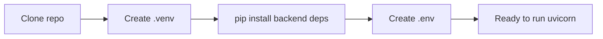

### 1. Clone and create a venv

```bash
git clone <repo-url> Base55
cd Base55
python -m venv .venv
```

**Windows (PowerShell)**

```powershell
.\.venv\Scripts\Activate.ps1
```

**macOS / Linux**

```bash
source .venv/bin/activate
```

### 2. Install dependencies

```bash
pip install -r src/backend/requirements.txt
pip install -r demo_api/requirements.txt   # optional — local OpenAPI demo only
```

Backend stack: `fastapi` · `uvicorn` · `python-dotenv` · `httpx` · `jinja2` · `openai`

### 3. Configure environment variables

Create `.env` at the **repo root** (auto-loaded by the backend):

```env
OPENAI_API_KEY=sk-...
```

Optional local Shopify helpers:

```env
SHOPIFY_STORE_DOMAIN=your-store.myshopify.com
SHOPIFY_STOREFRONT_TOKEN=shpat_or_storefront_token_here
```

**Windows (session-only)**

```powershell
$env:OPENAI_API_KEY = "sk-..."
```

**macOS / Linux**

```bash
export OPENAI_API_KEY=sk-...
```

> Do not commit `.env`. Generated Shopify `server.py` embeds credentials — treat zips as secrets.

---

## Quick start

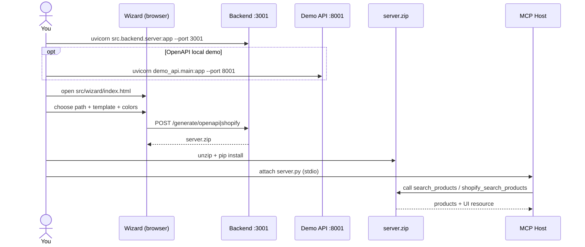

### 1. Start the generation backend

```bash
uvicorn src.backend.server:app --port 3001
```

- API: `http://localhost:3001`
- Health: `GET /healthz` → `{"status":"ok"}`

### 2. (Optional) Start the demo commerce API

```bash
uvicorn demo_api.main:app --host 127.0.0.1 --port 8001
```

- Spec for wizard: `http://127.0.0.1:8001/openapi.json`
- Products: `http://127.0.0.1:8001/v1/products`

### 3. Open the wizard

```
src/wizard/index.html
```

No npm / build step. Wizard POSTs to `http://localhost:3001`.

### 4. Generate → download `server.zip`

### 5. Run the generated server

```bash
unzip server.zip -d my-mcp-server
cd my-mcp-server
pip install -r requirements.txt
python server.py
```

`server.py` uses **stdio**. A bare terminal run looks idle — attach an MCP host.

---

## Wizard walkthrough

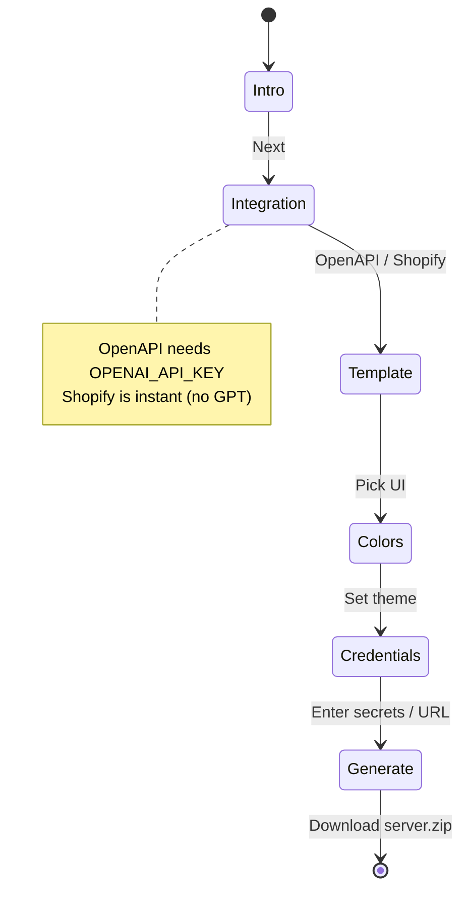

| Step | What you do |
|------|-------------|
| 1. Intro | Overview of Base55 |
| 2. Integration | OpenAPI **or** Shopify |
| 3. Template | `carousel` / `carousel-light` / `grid-dark` |
| 4. Colors | Primary, accent, background |
| 5. Credentials | Spec URL **or** `*.myshopify.com` + Storefront token |
| 6. Generate | Download `server.zip` |

Inline errors cover unreachable backend, bad colors, missing API key, invalid domain, etc.

---

## OpenAPI path

### Pipeline

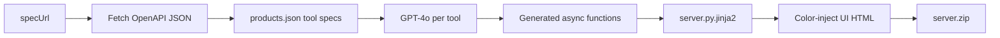

1. `POST /generate/openapi` with `specUrl`, template, colors  
2. Backend fetches OpenAPI (`httpx`, 15s timeout)  
3. `templates/products.json` drives GPT-4o (`src/openapi/generator/`)  
4. Each tool (e.g. `search_products`, `get_all_products`) becomes a standalone async function that:
   - Picks the best list/search endpoint
   - Hardcodes `servers[0].url`
   - Returns the fixed product shape below  
5. `templates/mcp_server/server.py.jinja2` wraps FastMCP + UI  
6. Zip returned to the browser  

### Canonical product payload

```json
{
  "products": [
    {
      "id": "string",
      "title": "string",
      "price": "$29.99",
      "image_url": "string",
      "description": "string",
      "link": "string"
    }
  ]
}
```

```text
  API response fields ──map──► carousel schema
       name / title  ───────►  title
       price number  ───────►  "$29.99"
       missing field ───────►  ""
```

### Generator rules

- GPT writes **only** tool bodies — MCP plumbing stays in Jinja2  
- Prices are strings; missing fields are `""`  
- Names/signatures must match `products.json`  

### Local demo tip

```
http://127.0.0.1:8001/openapi.json
```

The **backend process** must reach that URL (same machine localhost is fine).

---

## Shopify path

### Pipeline

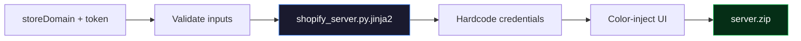

No GPT call. Credentials are **baked into** `server.py`.

### Validation

| Field | Rule |
|-------|------|
| `storeDomain` | Must end with `.myshopify.com` |
| Domain / token | No `{`, `}`, or newlines |
| Colors | `#rgb` / `#rrggbb` or `rgb(r,g,b)` |

### Storefront token setup

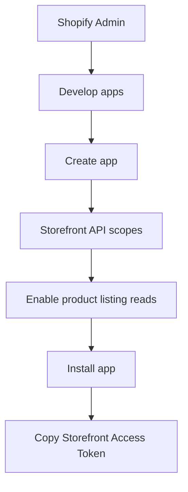

### Runtime shape

```text
  Goose / Claude
        │  stdio
        ▼
  server.py  ──GraphQL──►  your-store.myshopify.com
        │
        └── UI resource ──►  carousel / grid HTML
```

---

## Demo commerce API

Local catalog for OpenAPI experiments (`demo_api/`).

```bash
uvicorn demo_api.main:app --host 127.0.0.1 --port 8001
```

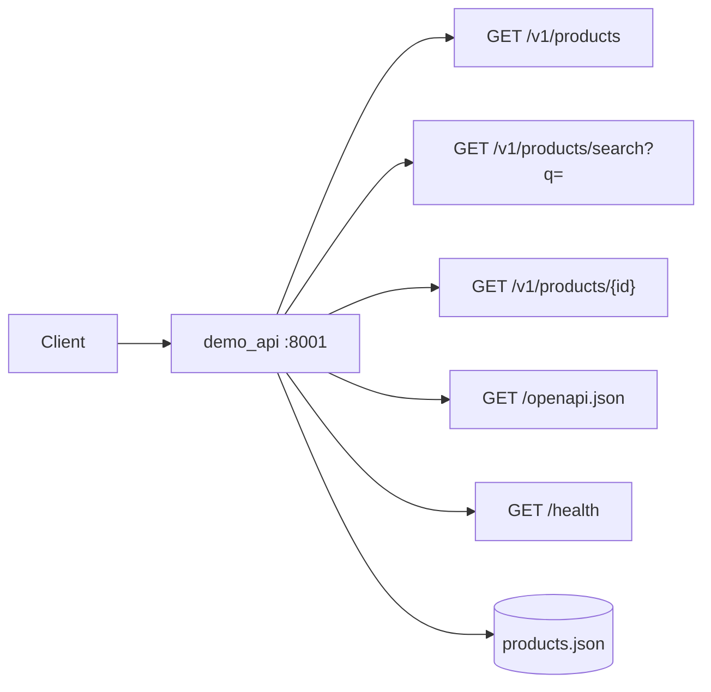

| Endpoint | Description |
|----------|-------------|
| `GET /openapi.json` | Paste into wizard |
| `GET /v1/products` | Paginated list |
| `GET /v1/products/search?q=...` | Keyword search |
| `GET /v1/products/{id}` | Single product |
| `GET /health` | Health check |

Seed data: `demo_api/data/products.json` · Optional YAML: `demo_api/demo_api.yaml`

---

## Generated server output

### Package tree

```text
server.zip
│
├── server.py           ◄── FastMCP (stdio) + tools + UI resource
├── requirements.txt    ◄── fastmcp==3.2.4 + httpx
└── carousel.html       ◄── or carousel-light.html / grid-dark.html
```

### Install + smoke test

```bash
cd my-mcp-server
python -m venv .venv
source .venv/bin/activate   # Windows: .\.venv\Scripts\Activate.ps1
pip install -r requirements.txt
python -c "import server; print('ok')"
```

### Venv separation (important)

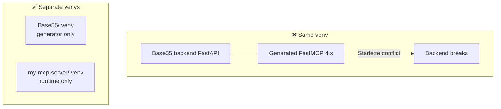

Generated servers pin **`fastmcp==3.2.4`**. Keep wizard backend and runtime servers in different virtualenvs.

---

## Connecting MCP hosts

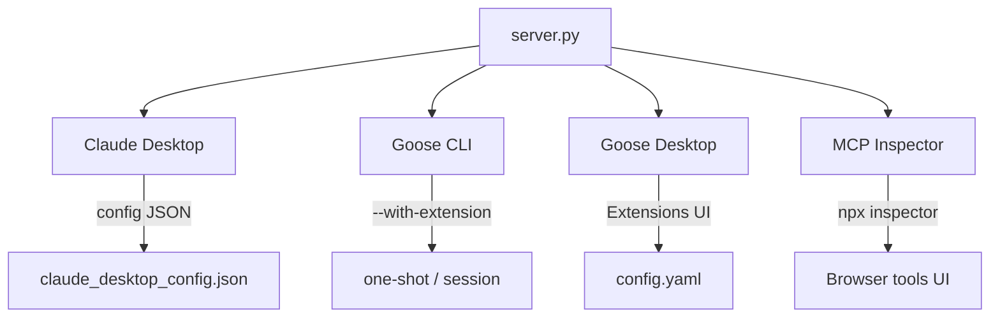

### Claude Desktop

Config paths:

- **macOS:** `~/Library/Application Support/Claude/claude_desktop_config.json`
- **Windows:** `%APPDATA%\Claude\claude_desktop_config.json`

```json
{
  "mcpServers": {
    "base55": {
      "command": "python",
      "args": ["server.py"],
      "cwd": "/absolute/path/to/my-mcp-server"
    }
  }
}
```

Windows with venv Python:

```json
{
  "mcpServers": {
    "base55": {
      "command": "C:\\Users\\you\\path\\to\\my-mcp-server\\.venv\\Scripts\\python.exe",
      "args": ["server.py"],
      "cwd": "C:\\Users\\you\\path\\to\\my-mcp-server"
    }
  }
}
```

Restart Claude → ask “search for snowboard products”.

### MCP Inspector

```bash
npx @modelcontextprotocol/inspector python server.py
```

```bash
npx @modelcontextprotocol/inspector /path/to/.venv/Scripts/python.exe server.py
```

Connect → **Tools** → call `search_products` / `shopify_search_products`.

### Goose (CLI)

```bash
goose run --no-session --provider openai --model gpt-4o \
  --with-extension "base55:/path/to/.venv/bin/python /path/to/my-mcp-server/server.py" \
  -t "Search for snowboard products and summarize titles and prices."
```

**Windows**

```powershell
goose run --no-session --provider openai --model gpt-4o `
  --with-extension "base55:C:\path\to\.venv\Scripts\python.exe C:\path\to\my-mcp-server\server.py" `
  -t "Search for snowboard products and summarize titles and prices."
```

### Goose Desktop

1. Install from [Goose releases](https://github.com/block/goose/releases) (`Goose-win32-x64.zip` on Windows)  
2. Add STDIO extension → venv `python.exe` + `server.py`  
3. Enable → chat  

Windows config often at:

```
%APPDATA%\Block\goose\config\config.yaml
```

```yaml
extensions:
  base55:
    name: Base55 Shopify
    cmd: C:\path\to\my-mcp-server\.venv\Scripts\python.exe
    args:
      - C:\path\to\my-mcp-server\server.py
    enabled: true
    type: stdio
    timeout: 300
```

---

## Architecture deep dive

### End-to-end

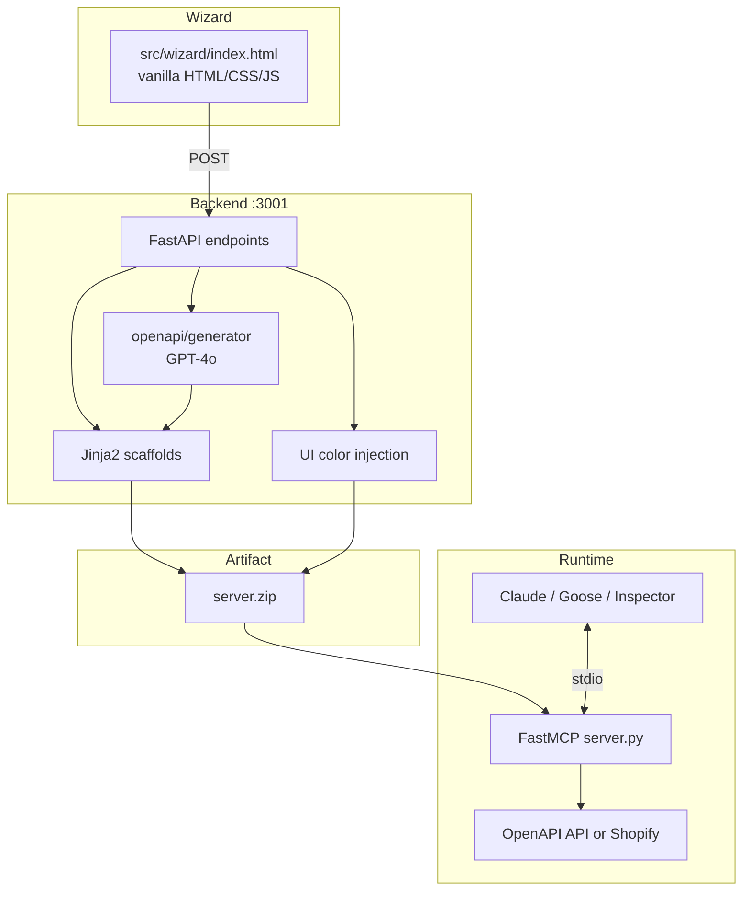

### Request → zip (OpenAPI)

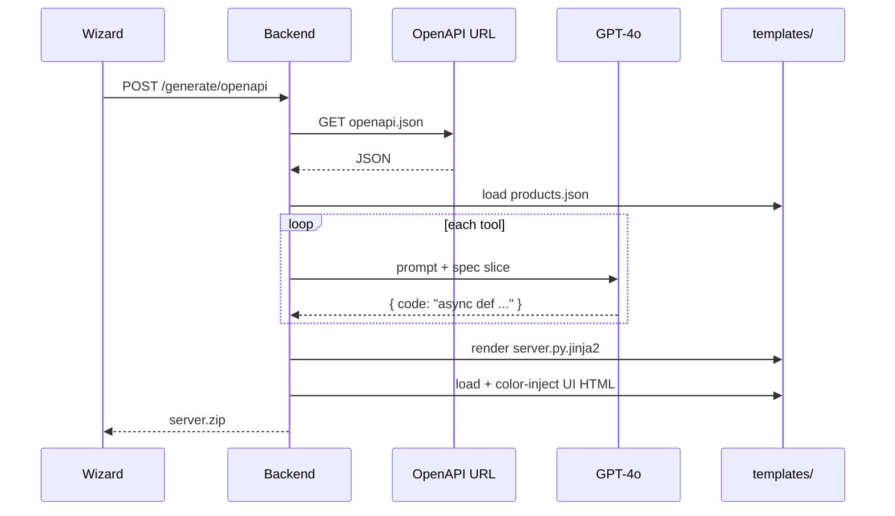

### Design decisions

| Decision | Why |
|----------|-----|
| GPT writes only tool logic | Keeps MCP/UI wiring stable in Jinja2 |
| Hardcoded base URLs | Generated servers run without extra env config |
| Fixed output schema | Carousel/grid always get the same product shape |
| Multi-format UI messages | Works across more MCP host wrappers |
| No-build wizard | `file://` + CORS `*` for local DX |

---

## Backend API reference

Base: `http://localhost:3001`

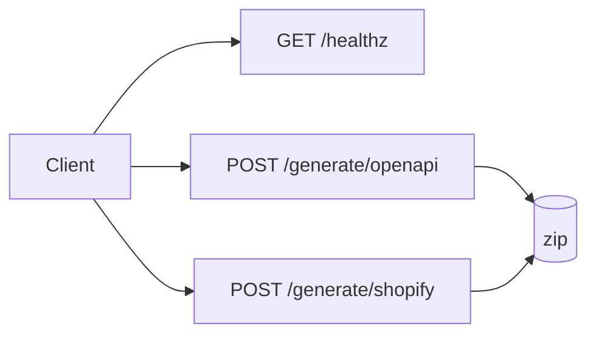

### `GET /healthz`

```json
{ "status": "ok" }
```

### `POST /generate/openapi`

```json
{
  "specUrl": "http://127.0.0.1:8001/openapi.json",
  "template": "carousel",
  "primaryColor": "#3b82f6",
  "accentColor": "#22c55e",
  "bgColor": "#0f0f0f"
}
```

→ `application/zip` (`server.zip`)

### `POST /generate/shopify`

```json
{
  "storeDomain": "your-store.myshopify.com",
  "storefrontToken": "your-storefront-token",
  "template": "grid-dark",
  "primaryColor": "#3b82f6",
  "accentColor": "#22c55e",
  "bgColor": "#0f0f0f"
}
```

→ `application/zip` (`server.zip`)

Allowed `template`: `carousel` · `carousel-light` · `grid-dark`

---

## UI templates and theming

```text
templates/ui/
├── carousel.html         ████ dark scroll
├── carousel-light.html   ░░░░ light scroll
└── grid-dark.html        ▦▦▦ dark grid
```

Injected at generate time (before `</head>`):

```css
:root {
  --primary-color: ...;
  --accent-color: ...;
  --bg-color: ...;
}
```

### Add a UI template

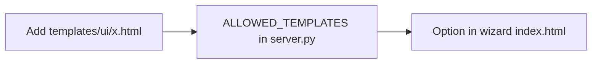

### Add an integration path


---

## Repository layout

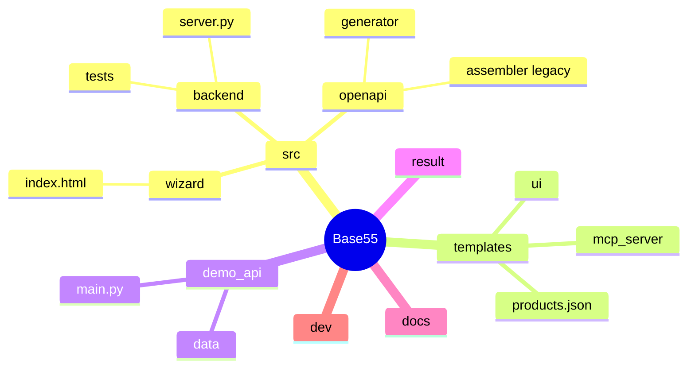

```text
Base55/
├── README.md
├── CLAUDE.md
├── .env                          # local secrets (gitignored)
├── src/
│   ├── backend/
│   │   ├── server.py             # generator API :3001
│   │   ├── requirements.txt
│   │   └── tests/
│   ├── wizard/
│   │   └── index.html            # no-build wizard
│   └── openapi/
│       ├── generator/            # GPT-4o tool gen (active)
│       └── assembler/            # legacy TS (unused)
├── templates/
│   ├── products.json
│   ├── mcp_server/
│   │   ├── server.py.jinja2
│   │   └── shopify_server.py.jinja2
│   └── ui/
│       ├── carousel.html
│       ├── carousel-light.html
│       └── grid-dark.html
├── demo_api/
├── result/                       # example generated output
├── docs/
└── dev/                          # local experiments
```

---

## Development and tests

```bash
pip install -r src/backend/requirements.txt
pytest src/backend/tests -q
```

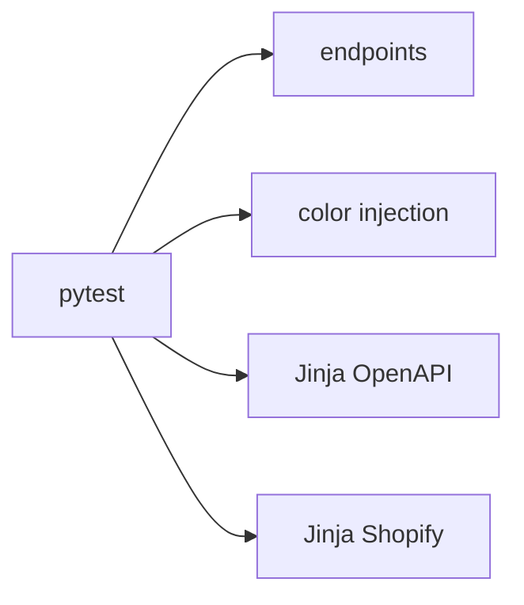

Health checks:

```bash
curl http://localhost:3001/healthz
curl http://127.0.0.1:8001/health
```

---

## Troubleshooting

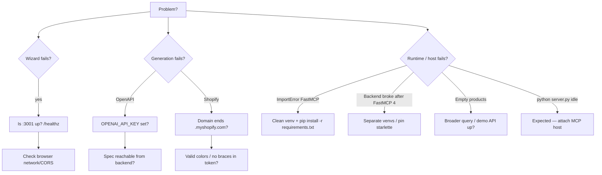

### Wizard cannot reach backend

- `uvicorn src.backend.server:app --port 3001`
- Open `http://localhost:3001/healthz`
- Check browser console for network errors

### OpenAPI generation fails

- Set `OPENAI_API_KEY` in `.env` or environment  
- Spec URL must be reachable **from the backend process**  
- Bad JSON → HTTP 400; see uvicorn logs  

### Shopify generation fails

- Domain must end with `.myshopify.com`  
- No `{`, `}`, newlines in credentials  
- Colors: hex or `rgb(...)`  

### `ImportError: cannot import name 'FastMCP'`

```bash
pip uninstall -y fastmcp fastmcp-slim
pip install -r requirements.txt
python -c "from fastmcp import FastMCP; print(FastMCP)"
```

Use a clean venv for the generated server.

### FastAPI backend breaks after latest FastMCP

FastMCP 4.x can pull Starlette 1.x vs FastAPI 0.115. Separate venvs, or:

```bash
pip install "starlette>=0.40.0,<0.47.0"
```

### Tools work but products empty

- Shopify: try `*`, `the`, or a type that exists in the catalog  
- OpenAPI/demo: ensure `:8001` is up and base URL matches  
- Inspect raw tool output in MCP Inspector first  

### `python server.py` “does nothing”

Expected for stdio MCP — attach Claude, Goose, or Inspector.

---

## Security notes

```text
  ┌─────────────────────────────────────────────┐
  │  server.py may contain Storefront tokens    │
  │  → treat zip as a secret                    │
  │  → never commit generated credentials       │
  └─────────────────────────────────────────────┘
```

- Shopify tokens are **embedded** in generated `server.py`  
- Color/credential validation reduces simple injection; still treat inputs as untrusted  
- CORS is wide open (`*`) for local wizard DX — tighten before any networked deploy  
- Keep `.env` out of git  

---

## Legacy code

| Path | Status |
|------|--------|
| `src/openapi/assembler/` | Legacy TypeScript / Handlebars — unused |
| `src/shopify/` | Legacy TS Shopify demo — unused |

```mermaid
flowchart LR
  Active["Python + FastAPI + Jinja2 + FastMCP"]:::on
  Legacy["TS assembler / old Shopify demo"]:::off

  classDef on fill:#052e16,stroke:#22c55e,color:#fff
  classDef off fill:#3f3f46,stroke:#71717a,color:#ddd
```

---

## License / contributing

See the repo license (if present) and `CLAUDE.md` for contributor architecture notes. When you add templates or integrations, update **backend allow-lists and the wizard UI** together so generation stays consistent.
